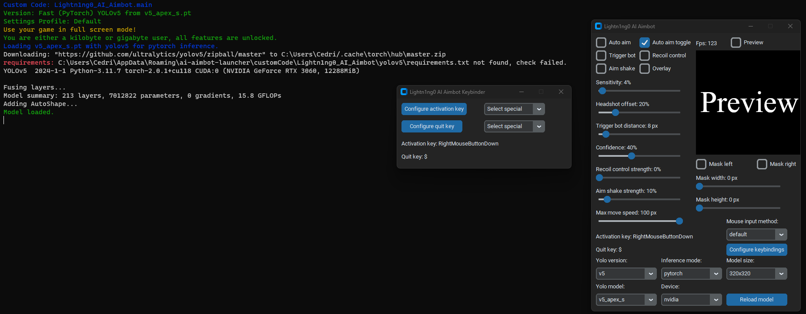

# Lightn1ng0_AI_Aimbot
Lightn1ng0's custom code for the [rootkit launcher](https://github.com/RootKit-Org/Launcher).  
The point of this code is being able to change settings and swap models without restarting anything.

This custom code aimbot will load the settings and configuration from the launcher.  
The code has all features from the launcher + more. Except for the fov circle.  
The code uses the model files from the launcher.  
The code does not modify the launcher config.

## Features
### Tier 0 (free)
- Everything that is free from the launcher

### Tier 1 (byte and infrequent volunteers)
- Everything that you get with tier 1 from the launcher
- Adjust settings live from the menu

### Tier 2 (kilobyte and frequent volunteers)
- Everything that you get with tier 2 from the launcher
- Hot swapping model
- Hot swapping inference mode
- Hot swapping yolo version
- Hot swapping screenshot size
- Recoil control
- Overlay (testing purposes --> overlay causes detection issues)
- Max move speed
- Keybind configurator
- Mouse input methods (default is win32api, razer, arduino)

## Controller support (Tier 2 or higher only)
- Should work with xbox controllers and playstation controllers
- Select either ds4 for playstation or x360 for xbox
- You need to install the vigem bus driver --> https://github.com/nefarius/ViGEmBus/releases/download/v1.22.0/ViGEmBus_1.22.0_x64_x86_arm64.exe
- You will also need to install hidhide --> https://github.com/nefarius/HidHide/releases/download/v1.5.212.0/HidHide_1.5.212_x64.exe
- Setup video --> coming soon, for now ask me in discord on how to

## Razer support (Tier 2 or higher only)
- Works only if you have a razer mouse plugged in to your computer
- You need to install razer synapse 3 with the macro module https://www.razer.com/synapse-3
- Download this dll file and move it to `%appdata%/ai-aimbot-launcher/customCode/Lightn1ng0_AI_Aimbot/rzctl_lib` --> https://github.com/0736b/rzctl-py/raw/main/rzctl_lib/rzctl.dll
- The dll file should be safe but use at your OWN risk!
- Credits to https://github.com/0736b/rzctl-py/tree/main for the driver

## Arduino support (Tier 2 or higher only)
- You can use any arduino that supports the mouse library --> https://www.arduino.cc/reference/en/language/functions/usb/mouse/
- You can make your game detect your arduino as if it was your real mouse by spoofing it or using an usb host shield --> see setup tutorials
- Download and upload Mouse.ino or MouseShield.ino file to arduino depending if you have an usb host shield or not
- Automatically configures com port when arduino is plugged in while launching
- You can still manually configure the com port from the gui
- Credits to https://github.com/TrevorSatori/Leonardo/tree/main
- Thanks to duurtlang on discord for helping me out debugging Mouse.ino
### Arduino setup tutorials
- Setup the arduino leonardo with usb host shield https://www.youtube.com/watch?v=NlUyUGYHMAc
- Spoof your arduino https://www.youtube.com/watch?v=CcfnBOqdLVg

## Issues
- Converting model to onnx on amd or cpu does not work --> use the launcher to do this
- Fov circle not implemented
- Sometimes bettercam stops working
- Code will not detect models that don't start with the prefix v5 or v8. (It will load models without this prefix when passed from the launcher)
